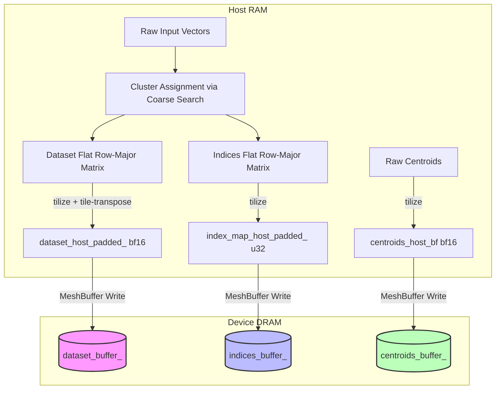

# Memory Layout & Data Representation in IVF Fine Search

This document explains the memory layout and data representations used in the instrumented `ann_ivf_mem_log`
multi-core IVF Fine Search example. It details how vector datasets, index mapping, and centroids are structured in
Host RAM, how they are tilized/transposed, and how they are stored/paged in Device DRAM.

---

## 1. Overview of Data Flow



During indexing, the host assigns raw query/dataset vectors to clusters and formats the data for the TensTorrent hardware. The hardware relies on **32x32 tiles** and requires data to be in **tilized** format.

To minimize memory footprint, a **non-uniform DRAM paging** architecture is used. Each cluster is padded only to its own size, and vector block data is laid out column-major to enable single-command contiguous NOC reads.

---

## 2. Data Representation in Host RAM

### A. Centroids Layout
Raw centroids are loaded as a 1D vector of shape `(n_centroids, dim_)`.
Before sending to the device, the centroids are rearranged on the host to shape `(padded_dim, n_centroids)`:
- `padded_dim`: `dim_` rounded up to a multiple of 32.
- Layout: Row-major, where each row represents a dimension `d`, and each column represents a centroid `i`.
- The flat matrix is then tilized using `tilize_nfaces`.
- **DRAM Configuration**: Centroids are allocated as a replicated buffer with a page size of **2048 bytes** (exactly 1 tile). This allows the coarse search reader kernel to fetch centroids tile-by-tile interleaved across DRAM banks.

---

### B. Cluster Sizing & Non-Uniform Offsets
Instead of padding all clusters to a global maximum (`max_blocks_`), each cluster `i` only allocates memory for its own size:
1. For each cluster `i`, the number of vectors is `count`.
2. The number of 32-vector blocks needed is `cluster_blocks = std::max(2u, (count + 31) / 32)`. (A minimum of 2 blocks is enforced to satisfy sequential merge dependencies).
3. The cluster is padded to `padded_count = cluster_blocks * 32` vectors.
4. The starting page of cluster `i` in the DRAM buffer is tracked using `current_page_offset`, which starts at 0 and increments by `cluster_blocks` for each cluster. The metadata is saved in `cluster_toc_[i]` as:
   `cluster_toc_[i] = {start_page, count, padded_count, 0}`

---

### C. Dataset Column-Major Layout (`dataset_host_padded_`)
For each cluster `i`, the host builds a flat row-major matrix of shape `(padded_dim, padded_count)` where:
- `padded_dim`: `dim_` rounded up to a multiple of 32.
- `padded_count`: `cluster_blocks * 32`.

#### 1. Flat Matrix Construction
The matrix is structured such that each row represents a dimension, and each column represents a vector in the cluster:
```
                               padded_count (vectors)
                    v_0     v_1    ...    v_k     v_{padded-1}
                 +-------+-------+-----+-------+---------------+
    d_0          | val   | val   | ... | 0.0   | 0.0           |
    d_1          | val   | val   | ... | 0.0   | 0.0           |
    ...          | ...   | ...   | ... | ...   | ...           |
    d_{padded-1} | val   | val   | ... | 0.0   | 0.0           |
                 +-------+-------+-----+-------+---------------+
```
- **Values**: Raw vector components are cast to `bfloat16` (2 bytes).
- **Padding**: Elements beyond `count` or `dim_` are filled with `0.0f`.

#### 2. Tilization & Column-Major Tile Transposition
The flat matrix of shape `(padded_dim, padded_count)` is first tilized.
- Let `Ht = padded_dim / 32` (number of tiles high).
- Let `Wt = cluster_blocks` (number of tiles wide).
In the default row-major tile layout outputted by `tilize_nfaces`, the tiles of a column are non-contiguous in memory:
`Tile(0,0), Tile(0,1), ..., Tile(0, Wt-1), Tile(1,0), Tile(1,1), ...`

To allow the device reader to fetch a column of tiles in a single NOC read, the host transposes the tiles from row-major to **column-major** order:
```cpp
for (uint32_t w = 0; w < Wt; w++) {
    for (uint32_t h = 0; h < Ht; h++) {
        cluster_tilized_col_major[w * Ht + h] = cluster_tilized[h * Wt + w];
    }
}
```
This reorganizes the tiles so that all dimensions of a 32-vector block (column `w`) are completely contiguous:
`Column 0: Tile(0,0), Tile(1,0), Tile(2,0), ...` followed by `Column 1: Tile(0,1), Tile(1,1), Tile(2,1), ...`

#### Concrete Example:
- **Parameters**: `dim_ = 96` (padded to `96` -> `Ht = 3`), `count = 50` vectors, `cluster_blocks = 2` (padded to `64` vectors -> `Wt = 2`).
- **Tiles Matrix**: `3x2` grid.
- **Transposed Tilized Layout in Host RAM**:
  `Tile(0,0), Tile(1,0), Tile(2,0) | Tile(0,1), Tile(1,1), Tile(2,1)`
- **Cluster Byte Size**: `6 tiles * 2048 bytes/tile = 12,288 bytes` (12 KB).

---

### D. Index Layout (`index_map_host_padded_`)
To align with Tenstorrent's 32x32 tile operations, the index list of a cluster must also be shaped as a tile grid.

#### 1. Flat Matrix Construction
The index matrix has a height of **32 rows** and width of `padded_count`:
- **Replication**: The vector indices are replicated across all 32 rows to form a full tile height.
- **Padding**: Indices beyond the actual vector count are padded with `0xFFFFFFFF` (used as a sentinel mask).
- **Data Type**: 32-bit unsigned integers (`uint32_t`, 4 bytes).

```
                               padded_count (vectors)
                    v_0     v_1    ...    v_k     v_{padded-1}
                 +-------+-------+-----+-------+---------------+
    row_0        | idx_0 | idx_1 | ... |  MASK |  MASK         |
    row_1        | idx_0 | idx_1 | ... |  MASK |  MASK         |
    ...          | ...   | ...   | ... | ...   | ...           |
    row_31       | idx_0 | idx_1 | ... |  MASK |  MASK         |
                 +-------+-------+-----+-------+---------------+
    (Note: MASK = 0xFFFFFFFF)
```

#### 2. Tilization
The flat index matrix of shape `(32, padded_count)` is tilized. Since the height is exactly 32 (`Ht = 1` tile), the row-major tile layout is already identical to column-major. No transposition is necessary.

---

## 3. Data Representation in Device DRAM

### A. MeshBuffer Setup & Replication
The multi-core system writes the entire index database and cluster dataset to DRAM using `distributed::ReplicatedBufferConfig`. This replicates the exact same database across the DRAM of all devices in the mesh.

### B. DRAM Buffer Configuration (Page Sizes)
To implement non-uniform paging, the DRAM buffers are configured with page sizes corresponding to a single 32-vector block:

```cpp
// 1. Dataset Buffer: Page size is the size of exactly ONE column of tiles (32 vectors)
uint32_t dataset_page_size = padded_dim * 64;
// 2. Indices Buffer: Page size is the size of exactly ONE index tile (32 indices)
uint32_t index_page_size = 4096;
```

#### Mathematical Verification of Page Sizes:
* **Dataset Page Size (bytes)**:
  $$\text{Page Size} = \frac{\text{padded\_dim}}{32} \text{ tiles} \times (32 \times 32 \times 2\text{ bytes}) = \text{padded\_dim} \times 64\text{ bytes}$$
* **Index Page Size (bytes)**:
  $$\text{Page Size} = 1 \text{ tile} \times (32 \times 32 \times 4\text{ bytes}) = 4096\text{ bytes}$$

Because every page of the dataset buffer has a size of `padded_dim * 64` bytes, a cluster `i` with `Wt` blocks occupies exactly `Wt` consecutive pages in DRAM, starting at page ID `start_page_i` (which is passed from the host).

---

## 4. How Device Kernels Retrieve the Data

The host passes the starting base addresses of the buffers (`dataset_buffer_->address()`, `indices_buffer_->address()`), and the page sizes as runtime arguments to the reader kernel.
For each cluster to search, it also passes the cluster's `start_page` and its number of blocks `Wt`.

Inside the reader kernel:
- To fetch block `w` (where `0 <= w < Wt`) of a cluster, the kernel reads **Page `start_page + w`** from the dataset and index buffers.
- Since the dataset tiles within a page are stored column-major (contiguously), the kernel retrieves all dimensions of the 32-vector block in **a single contiguous NOC read** of size `dataset_page_size`:

```cpp
// Read entire vector column contiguously
noc_async_read(d_gen.get_noc_addr(start_page + w), l1_addr_d, dataset_page_size);

// Read corresponding indices
noc_async_read(idx_gen.get_noc_addr(start_page + w), l1_addr_i, index_page_size);
```

### Advantages of this layout:
1. **Zero Global Padding Wastage**: Clusters only occupy their actual number of blocks in DRAM (e.g. 10.5 MB instead of 167 MB for Glove-100), saving massive device memory.
2. **Single NOC Command**: Replacing the loop of `query_tiles_width` separate NOC reads with a single contiguous read significantly improves read latency and memory throughput.

## 5. Fine-Search Scheduling and Result Handoff

The profiling variant assigns each selected cluster as one whole-list task.
The host uses a batch-aware LPT heuristic that minimizes the largest worker
load in any logical 32-query batch before using aggregate load as a
tie-breaker. A task's weight is its padded block count multiplied by its
number of active query batches.

For each worker and logical batch, the query tiles are read once and retained
in the query circular buffer while all active clusters are processed.
Each candidate block queues its contiguous dataset-page read and index-tile
read before issuing one shared NoC read barrier.

Worker top-32 outputs use interleaved DRAM staging by default because it
measured faster than concentrating all 63 worker writes on logical core
`(0,0)`. The former direct core-0 L1 path remains selectable with
`--result-staging core0-l1` for A/B testing; `--result-staging dram` is the
default.
